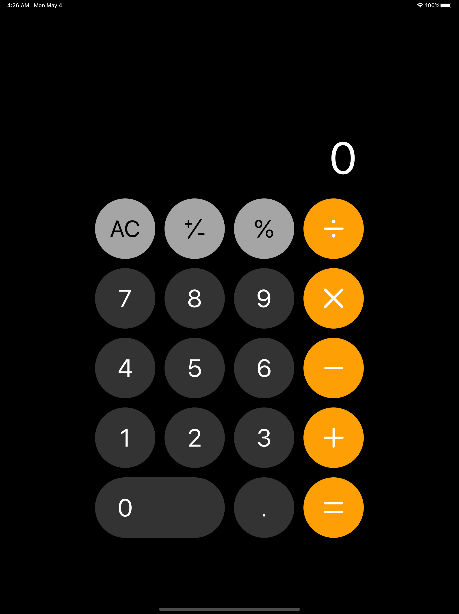
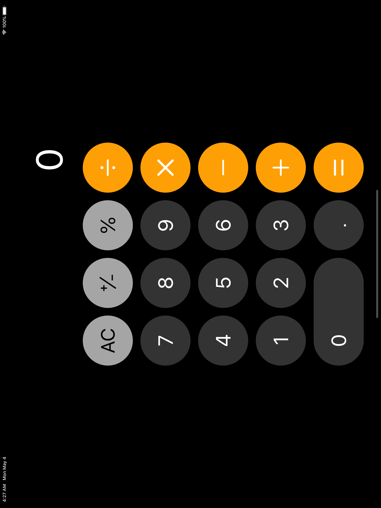
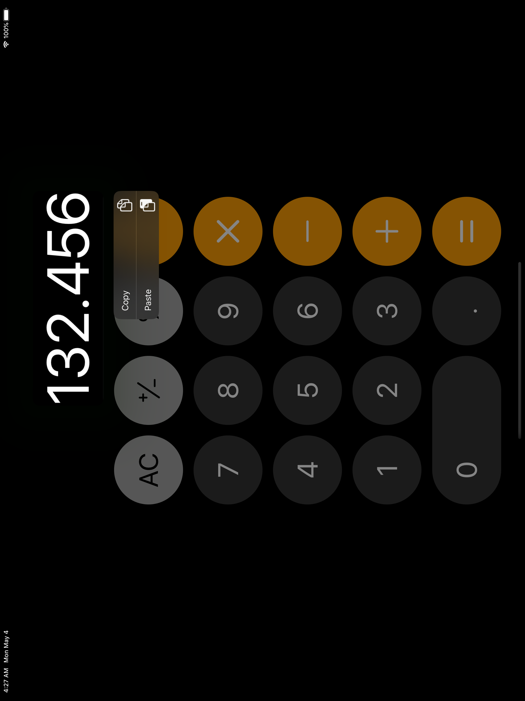

#  An clone of the built-in iOS Calculator APP for iPadOS, using SwiftUI

Yes, it looks exactly the same as the iOS built-in Calculator

The  UI is implemented by mimicing the iOS Calculator, by inspecting its colours and button positions. On iPad, it looks like an enlarged version of the iOS Calculator

## Why another duplicate of the calculator project?

Well, there are, indeed, a lot of calculator projects in GitHub and from other sources. However, here is a list of problems this repo tries to solve:

- Not many of the repos are built with SwiftUI, Apple's new love
- Some repos over complicates the use case of the calculator by adding too much funtions. It is just a simple calculator, as simple as iOS calculator
- There is not yet a calculator that simply implements the function of calculate. if they do, they are either paid, or with ads, or not updated for years, or broken. This repo is designed to publish to AppStore targeting general users who just need a simple calculator

## Why iPadOS does not have a built-in Calculator?

> “When they were prototyping the iPad, they ported the iOS calc over, but it was just stretched to fit the screen. It was there all the way from the beginning of the prototypes and was just assumed by everyone at apple that it was going to be shipped that way.
> A month before the release, Steve Jobs calls Scott Forstall into his office and says to him, “where is the new design for the calculator? This looks awful.” He said, “what new design?” This is what we are shipping with. Steve said, “no, pull it we can’t ship that.” Scott fought for it to stay in, but he knew he had to get their UI team involved to design a new look for the calculator but there was no way they could do it in that short time frame, so they just scrapped it.

*LUKE DORMEHL, Cult of Mac, https://www.cultofmac.com/421893/why-the-ipad-has-never-shipped-with-a-calculator-app/*

## Drawbacks

- built with SwiftUI, so the backward compatibility is problematic. Currently only builds to iPadOS, and from iOS 12 downwards are not supported

## Contributors

You are more than welcome to contribute!  
Feel free to create an issue to discuss potential improvements, bugs, or feedbacks!  
Feel free to create a PR if that's the best way to solve a problem! And then add your name to the list of contributors.  

- [@bofeiw](http://github.com/bofeiw) Creator

## TODO

- Support light color scheme
- Add advanced calculation as the landscape mode of the iOS Calculator
- Add App Widget
- Add Siri support
- Add home screen popover
